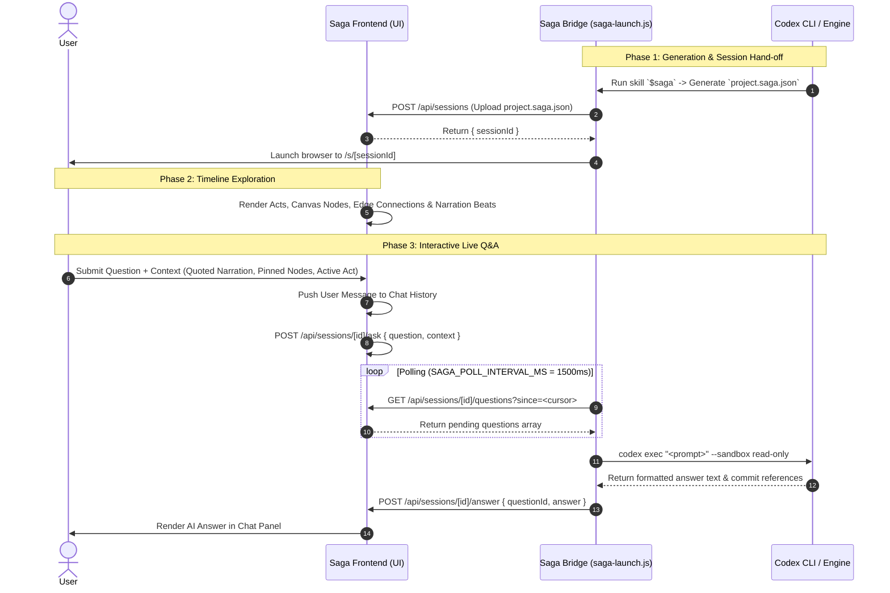

# Project Saga: UI ↔ Codex Data & Communication Interface Specification

## Executive Summary & Architecture Overview

**Project Saga** turns a git repository's commit history into an interactive, narrated architectural evolution tour. The system is split into two primary components:

1. **Frontend UI (Next.js App)**: A canvas-based interactive web application built with React Flow, Framer Motion, and Zustand state management. It renders the evolving module graph act-by-act, syncs narration playback, and provides a multi-tabbed chat interface.
2. **Backend Engine / CLI (Codex Agent & `saga-skill`)**: A set of deterministic shell/Node scripts and Codex CLI commands (`$saga`) that analyze commit logs, compute activity signals, cluster commits into narrated "Acts", format a structured `project.saga.json` file, and run a live Q&A bridge relay (`saga-launch.js`).

The communication between the **UI** and **Codex** operates in two modes:
- **Batch Handoff (Static Session)**: Codex generates `project.saga.json`, which is ingested by the UI to render the full historical timeline offline.
- **Live Bridge Relay (Interactive Session)**: A lightweight HTTP polling bridge (`saga-launch.js`) runs locally on the user's machine, relaying live user questions from the UI to `codex exec --sandbox read-only` and returning generated answers back to the UI chat panel.

---

## High-Level Data Flow Diagram



---

## Part 1: What UI Needs to Share with Codex (UI → Codex)

When the user navigates, searches, or asks questions within the Saga UI, specific payloads, context objects, and configuration parameters must be transmitted to Codex.

```
                  ┌──────────────────────────────────────────────┐
                  │              SAGA FRONTEND (UI)              │
                  └──────────────────────┬───────────────────────┘
                                         │
       ┌─────────────────────────────────┼─────────────────────────────────┐
       │                                 │                                 │
       ▼                                 ▼                                 ▼
1. Live Q&A Payload             2. Context Metadata              3. Local Repo Setup
 • Free-form Question Text       • Active Act ID                  • Local Clone Directory Path
 • Quoted Narration Beats        • Pinned Node IDs (Files)        • Session Operation Mode
 • Selected Canvas Modules       • Current Search Query           • Session ID Reference
```

### 1. Live Question & User Query Payload

When the user asks a question via the `ChatView` panel or clicks "Ask About This" on a node or file inspector:

| Payload Field | Data Type | Description | Source Component |
|---|---|---|---|
| `question` | `string` | The verbatim text typed by the user or pre-formulated by UI action. | `ChatView.tsx`, `FileInspector.tsx`, `ModuleNode.tsx` |
| `sessionId` | `string` | The unique identifier of the active session (e.g. `vscode-demo`). | Route param `/s/[sessionId]` |
| `pendingChatContext` | `Array<ContextItem>` | Quotes and snippets selected by the user to ground the question. | `NarrationView.tsx`, `ChatView.tsx` |
| `pinnedNodeIds` | `Array<string>` | List of file paths/modules pinned in the context tray. | `sagaStore.ts`, `ModuleNode.tsx` |
| `selectedNodeIds` | `Array<string>` | List of node IDs currently highlighted on the canvas. | `DiagramCanvas.tsx`, `FileInspector.tsx` |
| `activeActId` | `string` | The ID of the act currently visible on screen (e.g., `act-2`). | `ActSelector.tsx`, `sagaStore.ts` |
| `timestamp` | `number` | Unix timestamp of when the user submitted the query. | `ChatView.tsx` |

#### Example Payload Sent by UI (`POST /api/sessions/[id]/ask`):

```json
{
  "sessionId": "vscode-demo",
  "question": "Why did we rewrite the language service worker in Act 2?",
  "activeActId": "act-2",
  "context": {
    "quotedNarration": [
      {
        "actId": "act-2",
        "text": "Extension host now spawns plugins in isolated worker threads."
      }
    ],
    "pinnedFiles": [
      "src/vs/workbench/services/extensions/node/extensionHostProcess.ts"
    ],
    "selectedNodeIds": ["extensionHostProcess"]
  },
  "timestamp": 1722688000000
}
```

---

### 2. Local Repository Configuration & Integration State

During session loading and local environment setup (managed via `LoadSagaDialog`):

| Parameter | Data Type | Description | Source Component |
|---|---|---|---|
| `localPath` | `string \| null` | The absolute file path to the local repository clone on user's machine (e.g. `~/Workspace/code-oss`). | `LoadSagaDialog.tsx` |
| `isViewOnly` | `boolean` | Flag indicating if user opted out of local CLI execution (viewing pre-baked data only). | `memoryStore.ts` |
| `forceCloneSessionId` | `string` | Session ID passed when prompting user to clone a missing repository. | `LoadSagaDialog.tsx` |

---

### 3. User Navigation & Playback Signal Metrics (Telemetry / Context Expansion)

These parameters capture the user's active focus state for dynamic prompt context framing:

- **Active Act ID (`activeActId`)**: Indicates which chronological era Codex should prioritize when answering context-free questions.
- **Narration Playback Index (`activeNarrationIndex`)**: Identifies the precise narration beat currently playing during automated playback (`PlaybackControls.tsx`).
- **View Filter Mode (`isCinematicMode`)**: Indicates whether the canvas is currently filtered to show only core business logic nodes.

---

## Part 2: What Codex Needs to Share with the UI (Codex → UI)

Codex outputs two types of data for the UI:
1. **The Complete `.saga.json` Session Document**: Formatted, pre-baked structural data generated via the `$saga` skill pipeline.
2. **Live Q&A Stream / Responses**: Dynamically evaluated answers produced by `codex exec` in response to live user questions.

```
                  ┌──────────────────────────────────────────────┐
                  │            CODEX CLI & SAGA SKILL            │
                  └──────────────────────┬───────────────────────┘
                                         │
       ┌─────────────────────────────────┴─────────────────────────────────┐
       │                                                                   │
       ▼                                                                   ▼
1. Complete Session Data (.saga.json)                             2. Live Q&A Responses
 • Repository Metadata & Date Ranges                              • Formatted Markdown Answer
 • Chronological Acts & Narration Beats                           • Supporting Commit References
 • Architectural Module Graph & Edge Connections                  • Confidence Classification
 • Pre-baked Causal Q&A (Confirmed vs Inferred)                   • Execution Logs & Status
 • Tech Stack Timeline & Introduced Acts
```

### 1. `project.saga.json` Schema Specification (`SagaSessionSchema`)

The complete document standard written by Codex (`validate-saga.js`) and consumed by the UI (`schema.ts`):

```json
{
  "repo": {
    "name": "code-oss",
    "url": "https://github.com/microsoft/vscode",
    "totalCommits": 4820,
    "dateRange": {
      "start": "2015-04-01T00:00:00Z",
      "end": "2021-12-31T23:59:59Z"
    },
    "contributors": 142
  },
  "generation": {
    "model": "gemini-3.6-flash",
    "generatedAt": "2026-08-03T12:00:00Z",
    "estTokens": 145000,
    "estCostUsd": 0.042
  },
  "acts": [
    {
      "id": "act-1",
      "order": 1,
      "codename": "Atom-Shell Prototype",
      "dateRange": {
        "start": "2015-04-01",
        "end": "2015-09-30"
      },
      "commitCount": 320,
      "narration": [
        {
          "text": "Code-OSS began as a minimalist electron application wrapping Monaco editor.",
          "revealed": true
        }
      ],
      "keyCommits": [
        {
          "hash": "a1b2c3d",
          "message": "feat: initial commit of electron shell wrapper",
          "date": "2015-04-02"
        }
      ],
      "connections": [
        {
          "from": "mainProcess",
          "to": "rendererWindow",
          "kind": "ipc"
        }
      ],
      "modules": [
        {
          "name": "mainProcess",
          "path": "src/main/index.js",
          "status": "new",
          "linesChanged": 450,
          "summary": "Main Electron background entry point managing native windows."
        }
      ],
      "qa": [
        {
          "question": "Why was Atom-Shell chosen over native C++ UI?",
          "answer": "Commit #42 explicitly mentions rapid cross-platform UI prototyping with HTML5 canvas/DOM.",
          "confidence": "confirmed",
          "supportingCommits": ["a1b2c3d"]
        }
      ]
    }
  ],
  "techStack": [
    {
      "name": "Electron",
      "role": "Desktop App Shell",
      "introducedAct": "act-1",
      "docsUrl": "https://www.electronjs.org/docs"
    }
  ]
}
```

---

### 2. Detailed Data Breakdown (Codex → UI)

#### A. Repository Metadata (`repo`)
- **`name`** (`string`): Project name displayed in top header (`RepoContainer.tsx`).
- **`url`** (`string`): Git remote URL for external navigation.
- **`totalCommits`** (`number`), **`contributors`** (`number`): Statistics rendered in overview modals.
- **`dateRange`** (`{ start, end }`): Overall project lifespan.

#### B. Act & Timeline Objects (`acts[]`)
- **`order`** (`number`): Sequential index used for act transition animations.
- **`codename`** (`string`): Human-readable act theme (e.g., "LSP Refactor") displayed in `ActSelector.tsx`.
- **`narration[]`** (`{ text, revealed }`): Chronological storytelling beats rendered in `NarrationView.tsx` and highlighted during audio/autoscroll playback.
- **`keyCommits[]`** (`{ hash, message, date }`): Benchmark git commits anchored to this era.

#### C. Architectural Graph Nodes & Edges (`modules[]` & `connections[]`)
- **`name`** (`string`): Unique module identifier used by React Flow (`DiagramCanvas.tsx`).
- **`path`** (`string`): Relative file path within repository.
- **`status`** (`"new" | "modified" | "deleted" | "unchanged"`): Controls node color coding:
  - `new`: Pop Yellow (`#ffeb3b`)
  - `modified`: Pop Cyan (`#00e5ff`)
  - `deleted`: Pop Red (`#ff1744`) with trash animation trigger
  - `unchanged`: Clean white/black backdrop
- **`linesChanged`** (`number`): Total line delta in act slice.
- **`summary`** (`string`): Codex-written architectural role description displayed in `FileInspector.tsx` and node callouts.
- **`connections[]`**: Directed relationships (`from`, `to`, `kind` like `import`, `ipc`, `spawn`) rendered as React Flow edges.

#### D. Pre-baked Causal Q&A & Confidence Labels (`qa[]`)
- **`question`** (`string`): Common question a developer would ask about this act.
- **`answer`** (`string`): Rigorous answer compiled by Codex.
- **`confidence`** (`"confirmed" | "inferred"`):
  - **`confirmed`**: Direct evidence exists in commit message body stating *why* the change occurred. UI displays solid badge (`CheckCircle2`).
  - **`inferred`**: Reason deduced by structural/code pattern without explicit git commit statement. UI displays dashed badge (`HelpCircle`).
- **`supportingCommits`** (`string[]`): Array of git commit hashes validating the answer.

#### E. Live Q&A Answer Payload (`POST /api/sessions/[id]/answer`)

```json
{
  "questionId": "q-1722688000",
  "answer": "The language service worker was extracted into a separate process in Act 2 to prevent heavy AST parsing from blocking the main UI thread. Supporting commits: `c4f5e67` (refactor: move ts-server to child process).",
  "confidence": "confirmed",
  "referencedCommits": ["c4f5e67"],
  "timestamp": 1722688002000
}
```

---

## Part 3: Bridge REST Protocol Endpoint Summary

The local relay bridge (`scripts/saga-launch.js`) communicates with Next.js API routes using 5 core HTTP endpoints:

| Endpoint | Method | Sender | Receiver | Purpose | Payload |
|---|---|---|---|---|---|
| `/api/sessions` | `POST` | Bridge | Frontend | Upload `project.saga.json` file at launch | Raw `SagaSession` JSON |
| `/api/sessions/[id]` | `GET` | Frontend | Bridge/DB | Fetch full saga session on page load | None → Returns `SagaSession` |
| `/api/sessions/[id]/ask` | `POST` | Frontend | Server | Submit user question to queue | `{ question, context, actId }` |
| `/api/sessions/[id]/questions` | `GET` | Bridge | Server | Bridge polls for pending user questions (`?since=<cursor>`) | None → Returns `PendingQuestion[]` |
| `/api/sessions/[id]/answer` | `POST` | Bridge | Server | Post Codex CLI answer back to UI chat | `{ questionId, answer }` |

> [!IMPORTANT]
> **Sandbox Security Constraint**:
> All live Q&A queries executed by `saga-launch.js` against Codex CLI **must** enforce `--sandbox read-only`. Answering historical questions about a repository never requires write permissions.

---

## Part 4: Interactive UI Feature Mapping Matrix

| UI Component | Data Provided to Codex | Data Received from Codex |
|---|---|---|
| **`LoadSagaDialog.tsx`** | Local repo clone path, `isViewOnly` preference | Session ID, verification of repository existence |
| **`ActSelector.tsx`** | Selected `activeActId` | Act array, order, codenames, commit counts |
| **`PlaybackControls.tsx`** | Playback status (`isPlaying`), narration speed | Narration sequence, act boundary triggers |
| **`DiagramCanvas.tsx`** | Clicked node selection (`selectedNodeIds`), context menu anchors | Node list, position status (`new`/`deleted`), edges |
| **`FileInspector.tsx`** | Target file path for "Ask About This" | Auto-generated architectural summary, lines changed |
| **`ChatView.tsx`** | User question, pending context quotes, pinned file IDs | Streamed/posted AI answer, supporting commits |
| **`NarrationView.tsx`** | Selected narration quote (`addPendingChatContext`) | Narration text list, pre-baked Q&A (Confirmed/Inferred) |
| **`StackView.tsx`** | Act jump trigger (`introducedAct`) | Tech stack list, role descriptions, documentation URLs |

---

## Part 5: Summary Matrix of Data Exchange

### Summary: What UI Shares with Codex (UI → Codex)
1. **User Questions**: Natural language text typed in chat or triggered via file inspection buttons.
2. **Context Items**: Quoted narration beats (`actId`, `text`), pinned file paths (`pinnedNodeIds`), and active canvas selections (`selectedNodeIds`).
3. **Timeline Focus**: Currently active Act ID (`activeActId`) and narration playback index (`activeNarrationIndex`).
4. **Environment Settings**: User's local workspace path (`localPath`) for repository grounding.
5. **Polling Cursors**: Request timestamps/cursors for fetching unanswered question queues.

### Summary: What Codex Shares with the UI (Codex → UI)
1. **Repository Identity & Stats**: Name, repository URL, commit volume, contributor count, date spans.
2. **Historical Acts**: Clustered eras, codenames, key commit hashes, date ranges.
3. **Narration Stream**: Chronological storytelling beats explaining architectural transformations.
4. **Graph Topology**: Node lists, file paths, status flags (`new`, `modified`, `deleted`, `unchanged`), line metrics, and edge connections (`connections`).
5. **Honest Causal Q&A**: Answers explicitly tagged as `confirmed` (documented in commit messages) vs `inferred` (AI deduction).
6. **Live Answers**: Real-time markdown responses to user questions generated via read-only Codex execution.
7. **Tech Stack Chronology**: Introduced libraries, roles, and act associations.
